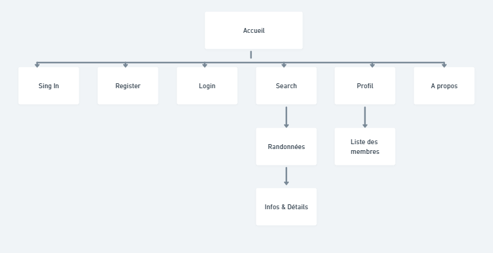

## Le cahier des charges

  

### Présentation du projet : GoForWalk

Application WEB pour des partages de randonnées.

#### Fonctionnalités  :
 - Itinéraires via une API comme google maps
 - Ajouter photos des parcours
 - Notations des randonnées
 - Informations sur la faune et la flore
 - Echange et rencontres entre randonneurs (Via espace membre, fonctionnalité message, etc..)

#### Opportunités :

Ce projet peut offrir aux étudiants un assez gros projet avec des fonctionnalités basiques.

Nous allons fortement utiliser GitHub pour le versioning de notre code et utiliser divers outils.

Des réunions seront effectuées chaque semaine afin de partager nos difficultés sur du code.

*Chaque semaine sera dirigée par un étudiant différent afin que toute l'équipe réalise les difficultés de gérer le projet.*

####  La définition des besoins et des objectifs du projet :

Le projet permet de répondre à une demande spécifique : 
- Trouver des itinéraires pour effectuer des randonnées.
- Permettre aux randonneurs chevronnés de créer des randonnées afin de partager des itinéraires
- Mettre en relation la communauté de randonneurs

#### Les fonctionnalités du projet (spécifications fonctionnelles) :

v1 : 
Site simple, sans API annexe :
Page d'accueil, page rando via /rando/:dynamique
Création de compte.
route creation rando, route modif rando.

v2 :
Création de randonnées une fois connecté (photos, description, ville, titre). ATTENTION, ATTRIBUER LA RANDO AU BON MEMBRE.
page membre
Modification d'une randonnée. 
Suppression d'une rando.
Recherche de randonnée via ville.
login/Token jwt(JsonWebToken)

v3 :
API MAPS via google maps.

v4 :
Commentaire
Contact entre membre
Recherche autour de soi

v5 : 
Bonus Back - 
TU 
Fonctions SQL
Index SQL

Bonus Front -
Typescript
NextJS
Websocket (amélioration du contact entre membre)

  
  
 

#### Public visé : 
- randonneur occasionnel
       
- randonneur chevronné 
        
  
  

#### Les navigateurs compatibles :

  Chrome , Firefox .

####  L'arborescence de l'application (le chemin de l'utilisateur) :

#### La liste des routes prévues :

route BACK :  
  
/API/auth/login  
/API/auth/register  
/API/trek/{getAllTrek}  
/API/trek/{getTrekByIdOrCity}  
/API/trek/createTrek  
/API/trek/updateTrek 
/API/user/{getUserById}  

route FRONT :  

/singin  
/register  
/profil  
/about  
/trek  
/search  
 
####  La liste des User stories : 

Voir fichier **[userstories.md](./userstories.md)**

#### La liste des rôles de chacun :

 - [x] Product Owner / Agile : Laurent
 - [x] Lead Dev Front : Dorian
 - [x] Lead Dev Back : Léo
 - [x] Git Master / Scrum : Franck
    